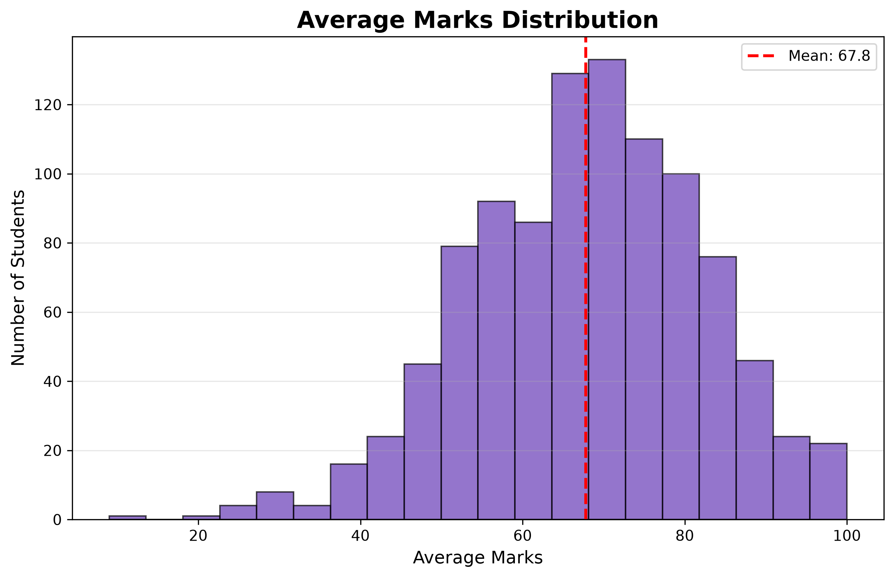
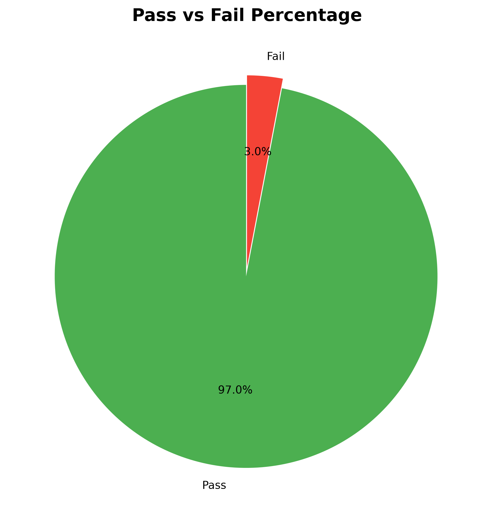
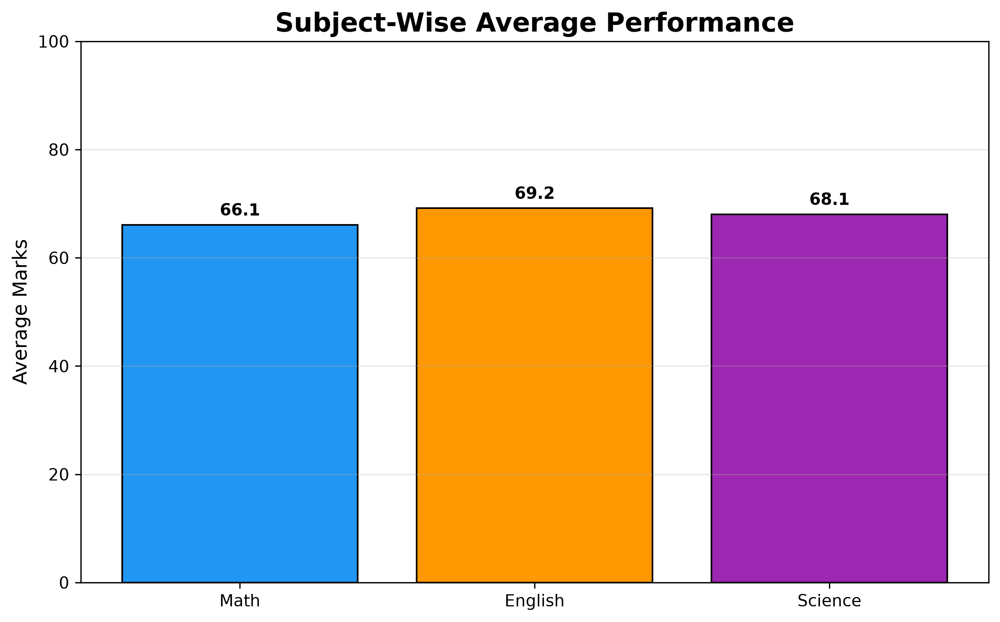
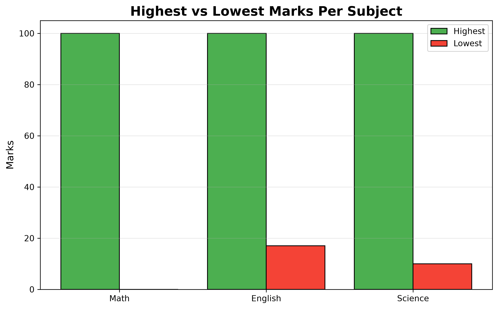

# 📊 Student Result Analysis - Python Data Project

## 🚀 Overview
Analyzed performance of 1000 students using Python, Pandas & Matplotlib. Generated key insights on pass rates, subject performance, and grade distribution.

## 🛠️ Tech Stack
**Python** | **Pandas** | **Matplotlib** | **CSV Processing**

## 📈 Key Results
- **Total Students**: 1000
- **Pass Rate**: 97% 
- **Fail Rate**: 3%
- **Average Score**: 67.8/100

## 📊 Visualizations





## 💡 Features
✅ Automated CSV data cleaning & processing 
✅ Statistical analysis - avg, max, min calculations 
✅ Pass/Fail classification with 40% threshold 
✅ Multiple chart generation with Matplotlib 

## 🔧 How to Run
```bash
pip install pandas matplotlib
python student_analysis.py
